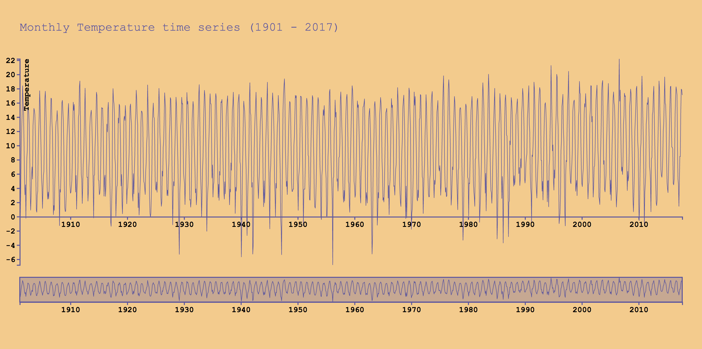

# Assessment 1

[(https://vriesm060.github.io/fe3-assessment-1/)

This data visualisation represents a monthly temperature time series of De Bilt between January 1901 and August 2017, as cleaned from [knmi.nl](http://www.knmi.nl/home).

## Background:
The purpose of this data visualisation is to show the differences in temperatures throughout a century. All of the data is presented. You can compare decades and by zooming in on the data you can also compare years or even months.

The data has been cleaned from [knmi.nl](http://www.knmi.nl/home) and the original visualisation was taken from the [Brush & Zoom code](https://bl.ocks.org/mbostock/34f08d5e11952a80609169b7917d4172), created by Mike Bostock. The code has been altered by myself to look and work the way it does.

## Data:

The following is a snippet from the given data set:

```
date,temp
19010131,-0.424
19010228,-0.761
19010331,3.369
19010430,8.782
19010531,12.181
19010630,14.363
19010731,18.402
19010831,16.36
19010930,14.567
```

The dataset is formatted in the CSV format and displays the date (YYYYMMDD) and the temperature (&deg;C).
For example: the first date, `19010131` translates to the 31st of January, 1901 and, according to this data set, the temperature on that day was `-0.424` &deg;C.

## Features:

### D3 Features:

* [timeParse](https://github.com/d3/d3-time-format/blob/master/README.md#timeParse) `var parseDate = d3.timeParse('%Y%m%d');`
* [scaleTime](https://github.com/d3/d3-scale/blob/master/README.md#scaleTime) `var xFocus = d3.scaleTime().range([0, width - margin.right]);`
* [scaleLinear](https://github.com/d3/d3-scale/blob/master/README.md#scaleLinear) `var yFocus = d3.scaleLinear().range([heightFocus, 0]);`
* [brushX](https://github.com/d3/d3-brush/blob/master/README.md#brushX) `var brush = d3.brushX()`
* [zoom](https://github.com/d3/d3-zoom/blob/master/README.md#zoom) `var zoom = d3.zoom()`
* [d3.extent](https://github.com/d3/d3-array/blob/master/README.md#extent) `d3.extent(data, function(d) { return d.date; })`
* [d3.min](https://github.com/d3/d3-array/blob/master/README.md#min) `d3.min(data, function(d) { return d.temp; })`
* [d3.max](https://github.com/d3/d3-array/blob/master/README.md#max) `d3.max(data, function(d) { return d.temp; })`
* [rescaleX](https://github.com/d3/d3-zoom/blob/master/README.md#transform_rescaleX) `xFocus.domain(t.rescaleX(xContext).domain());`

### Features humans can understand:

* Showing the minimum and maximum temperatures
* Able to view all the measured temperatures from a century
* Able to zoom in on the chart
* Understanding where on the chart you are, since the current range is highlighted on the overview
* Able to drag the chart to the position of your choice

## Interesting pieces of code:

These are some of the interesting pieces of code I wrote/altered.

```
focus.append('g')
      .attr('class', 'axis axis--x')
      .attr('transform', 'translate(0,' + (heightFocus - 97.5) + ')')
      .call(xAxis);
```
By changing the translation from `'translate(0,' + heightFocus + ')'` to `'translate(0,' + (heightFocus - 97.5) + ')'`, I raised the x-axis to meet up with the temperature 0 &deg;C, instead of the minimum temperature it was originally.

`var parseDate = d3.timeParse('%Y%m%d');`
Changed the timeParse so it would be the format that's being used in the data file.

Changed the starting position of the y-axis from `0` to `d3.min` so the temperatures lower than 0 were also visible on the chart.

**From:**
`yFocus.domain([0, d3.max(data, function(d) { return d.temp; })]);`

**To:**
`yFocus.domain([d3.min(data, function(d) { return d.temp; }), d3.max(data, function(d) { return d.temp; })]);`

`var width = screen.width - margin.left;`
Changed the width from a fixed number to `screen.width`, so the width of the SVG matches that of the user's screen.

## License:
**Original Chart created by:** Mike Bostock. GNU General Public License, version 3.

&copy; Max de Vries
